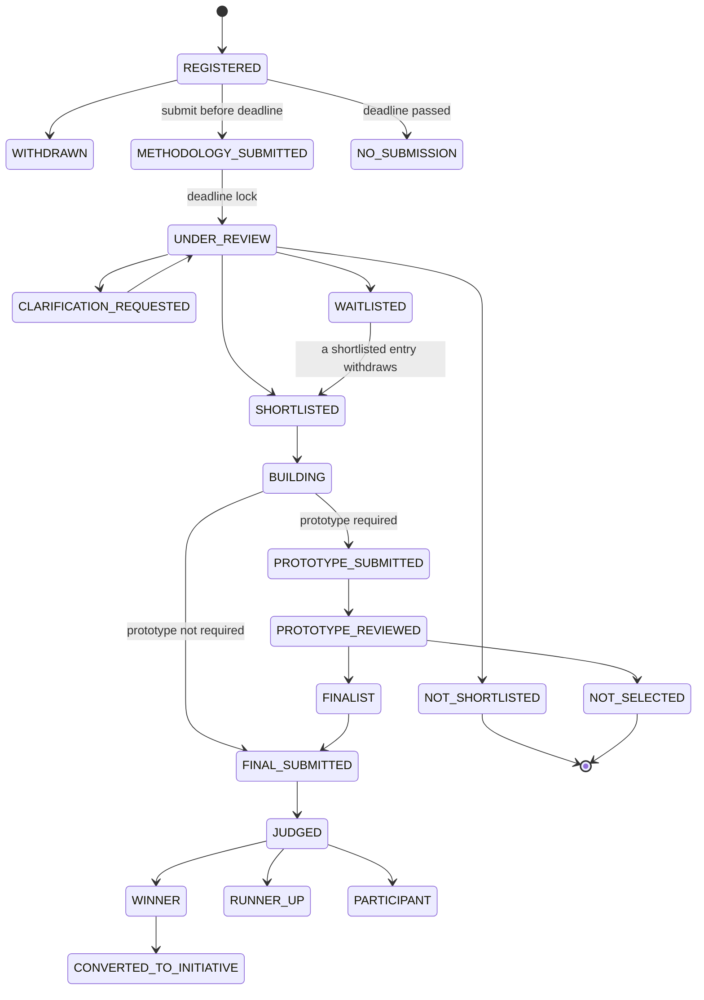
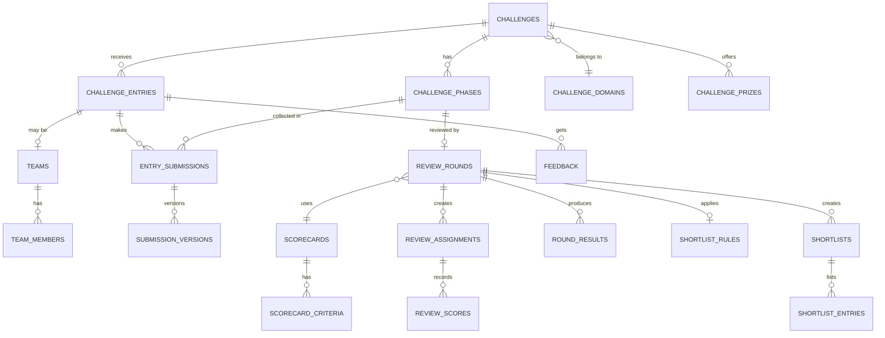

# InnovateX Hub — Backend Design & Data Model

**Stack:** FastAPI (Python) backend · React frontend · PostgreSQL database
**Version:** 1.1 (fixed role hierarchy, visibility rules, team join links) · **Date:** 04 Oct 2026
**Related documents:** INNO-BRD-001, INNO-PRD-001, InnovateX Hub Build Plan

---

## 0. How to read this file

This file describes the full backend: folder structure, rules every table follows, every table (grouped by module), the challenge flow in detail, the API list, events, and how to add new features and AI agents later.

Simple words used here:

| Word | Meaning |
| --- | --- |
| **Initiative** | An idea submitted by an employee (open idea, outside a challenge) |
| **Challenge** | A problem posted by the company with dates, rules and prizes |
| **Entry** | One registration in a challenge (one person or one team) |
| **Methodology** | The written plan an entry submits after registration: how they will solve the problem |
| **Round** | One review step (for example: methodology review, prototype review, final demo judging) |
| **Shortlist** | The list of entries allowed to go to the next phase |
| **Std columns** | The standard columns every table has (see section 3) |

---

## 1. Design goals

1. **Everything is configurable, not hard-coded.** Phases, deadlines, scorecards, weights, forms, emails, workflow states and roles live in tables. Admins change them without a code release.
2. **Ready for new features.** New modules plug in through events, custom fields and feature flags, without changing existing tables.
3. **Ready for AI agents.** AI agents are registered in tables, every AI run is logged, and AI output is always a *suggestion* that a human accepts or rejects.
4. **Ready for the whole group.** Every business row belongs to an organization unit, so AES first and other companies later need no redesign.
5. **Fair and auditable.** Every score, decision and status change is recorded and cannot be edited.
6. **Safe.** Confidential data is protected by data classification checks in the API, search, email and AI layers.

---

## 2. Technology stack (backend)

| Area | Choice | Why |
| --- | --- | --- |
| API framework | FastAPI | Async, fast, automatic OpenAPI docs for the React team |
| Language | Python 3.12+ | Team skill, strong AI ecosystem |
| ORM | SQLAlchemy 2.0 (async) | Mature, typed models |
| Validation | Pydantic v2 | Request/response schemas |
| Migrations | Alembic | Versioned database changes |
| Database | PostgreSQL 16+ | JSONB for flexible fields, full-text search, `ltree` for org tree, `pgvector` for AI search |
| Cache and queue | Redis | Caching, rate limits, job queue broker |
| Background jobs | Celery or ARQ | Emails, reminders, SLA checks, AI jobs, score calculation |
| File storage | Azure Blob Storage (or S3-compatible) | Attachments and evidence, with signed URLs |
| Auth | Microsoft Entra ID (OIDC / OAuth2) + JWT | Company single sign-on |
| Email | Microsoft Graph API or SMTP | Notifications |
| Search | PostgreSQL full-text first; OpenSearch later if needed | Start simple |
| AI | Provider-agnostic AI gateway service (Azure OpenAI, Anthropic, local models) | Swap models without code change |
| Observability | OpenTelemetry, structured JSON logs, Prometheus/Grafana or Azure Monitor | Errors, slow APIs, failed emails |
| Tests | pytest, pytest-asyncio, httpx, factory-boy | Automated testing |

---

## 3. Rules every table follows (conventions)

### 3.1 Standard columns ("std columns")

Every table has these columns unless it says otherwise:

| Column | Type | Notes |
| --- | --- | --- |
| `id` | `uuid` PK | Generated with `uuid7` (time-ordered, good for indexes) |
| `created_at` | `timestamptz` | Default `now()` |
| `created_by` | `uuid` FK → `users.id` | Null for system |
| `updated_at` | `timestamptz` | Updated on every change |
| `updated_by` | `uuid` FK → `users.id` | |

**Business tables** (initiatives, challenges, entries, submissions, etc.) also have:

| Column | Type | Notes |
| --- | --- | --- |
| `org_unit_id` | `uuid` FK → `org_units.id` | Owner organization; used for access scope |
| `row_version` | `int` | Optimistic locking; stops two users overwriting each other |
| `deleted_at` | `timestamptz` null | Soft delete. Nothing important is ever hard-deleted |
| `extra` | `jsonb` default `{}` | Values of custom fields (section 5.3). New fields without migrations |

### 3.2 Naming and types

- Table names: plural `snake_case` (`challenge_entries`). Columns: `snake_case`.
- Foreign keys: `<thing>_id`. Indexed always.
- Status and type columns: `varchar(40)` holding a **code** (e.g. `METHODOLOGY_SUBMITTED`) checked against a lookup table or Python `StrEnum`. We avoid PostgreSQL native enums because adding values needs migrations.
- Money: `numeric(14,2)` + `currency_code char(3)` (default `BDT`).
- All times stored in UTC (`timestamptz`); the UI shows local time (Asia/Dhaka).
- Human-readable codes: `INNO-2026-000123`, `CHL-2026-007`, `ENT-2026-007-0042`, generated from `id_sequences` (section 5.13).
- Translatable text (English/Bangla): stored as `jsonb` like `{"en": "...", "bn": "..."}` in columns ending with `_i18n`.

### 3.3 Polymorphic links

Some tables (comments, attachments, audit logs, AI suggestions, workflow instances, embeddings) can attach to **any** record. They use:

| Column | Type | Example |
| --- | --- | --- |
| `entity_type` | `varchar(60)` | `initiative`, `challenge_entry`, `challenge_submission` |
| `entity_id` | `uuid` | The record id |

Index: `(entity_type, entity_id)`. The list of valid `entity_type` codes lives in `entity_types` (section 5.13), so a new feature registers its own type.

### 3.4 Access control rule

Every query on a business table goes through one **scope filter** in the service layer:
`org scope of the user's role` AND `data classification allowed for the user` AND `explicit grants` (team member, assigned reviewer, panel member). Never filter only in React.

---

## 4. Challenge flow (the main business process)

### 4.1 The flow in simple steps

1. **Program owner creates a challenge** in **any domain** — technology is not required. Examples: "Reduce cement plant energy use", "Faster employee onboarding", "Cut procurement paperwork", "Workplace safety", "Customer service", "Sustainability". They set phases with dates, eligibility, individual/team rules, the methodology form, scorecards, shortlist rules, prototype policy, prizes and panel.
2. **Challenge is published.** Eligible employees get an email and see it on the Home page.
3. **Registration phase.** Employees register alone or create a team. The team leader shares a **team join link**; anyone with the link sends a join request, and the leader approves or rejects it. Participants never see a list of other participants or teams.
4. **Methodology phase.** Inside the time window, each registered entry submits a **methodology** using the challenge's methodology form (problem understanding, approach, architecture, data needed, plan, team skills, expected impact, risks). Entries can save drafts and resubmit until the deadline. At the deadline, submissions are locked.
5. **Methodology review round.** The system assigns reviewers (with conflict-of-interest check). Reviewers score each methodology using the methodology scorecard and write feedback. The system calculates the weighted score per reviewer and the aggregated score per entry.
6. **Shortlisting.** The shortlist rule runs (for example: top 10 by score, or all entries with score ≥ 70, or manual choice). The program owner reviews and **confirms** the shortlist (a human always confirms). For each shortlisted entry, the program owner can set **prototype required = yes/no** (default comes from the challenge's prototype policy).
7. **Results of shortlisting are sent.** Shortlisted entries get next-step instructions. Not-shortlisted entries get their score and written feedback.
8. **Build phase.** Only shortlisted entries can submit work. They update milestones and upload evidence.
9. **Prototype phase (only if required).** Entries with `prototype_required = true` submit a prototype (link, repo, video, files). A prototype review round runs. Optionally a second shortlist (finalists) is made.
10. **Final submission and demo.** Finalists submit the final project and present at Demo Day (slots are booked in the system).
11. **Final judging round.** The jury scores with the final scorecard. People's Choice votes are counted if enabled.
12. **Results and awards.** The jury decides winners; the decision is approved and published; rewards are recorded; every entry gets feedback.
13. **After the challenge.** Winning entries can be converted into an **initiative** that continues to pilot, production, impact and scale.

### 4.2 Challenge status (the challenge itself)

`DRAFT → SCHEDULED → OPEN_FOR_REGISTRATION → METHODOLOGY_OPEN → METHODOLOGY_REVIEW → SHORTLISTING → BUILD → PROTOTYPE_REVIEW → FINAL_SUBMISSION → DEMO_AND_JUDGING → RESULTS_PENDING_APPROVAL → RESULTS_PUBLISHED → CLOSED`
(+ `CANCELLED`, `ON_HOLD`)

The exact phases are **not fixed**: they come from `challenge_phases` rows. A challenge without a prototype phase simply has no row for it.

### 4.3 Entry status (one participant or team in a challenge)



These states are stored as rows in the workflow tables (section 5.6), so they can be changed per challenge type.

### 4.4 Main tables used in the challenge flow



### 4.5 Shortlist calculation (how the score decides)

1. Each reviewer gives a rating per criterion (for example 1–5).
2. **Reviewer score** = Σ (rating ÷ max_rating × criterion weight). Result is 0–100.
3. **Entry score in a round** = aggregation of all reviewer scores, using the round's `aggregation_method`: `MEAN` (default), `MEDIAN`, `TRIMMED_MEAN` (drop highest and lowest when ≥ 5 reviewers), or `WEIGHTED_BY_REVIEWER` (e.g. jury weight 2, expert weight 1).
4. Optional **normalization** (`normalize = true`): each reviewer's scores are converted to z-scores before averaging, to remove "strict" or "generous" reviewer bias. Both raw and normalized scores are saved.
5. **Gate checks:** an entry fails the round if any criterion with `min_rating` gets an average below that minimum (for example "Feasibility must be at least 2").
6. **Disagreement flag:** if two reviewers differ by `≥ disagreement_threshold` on any criterion, `round_results.needs_discussion = true` and the shortlist cannot be confirmed until it is resolved.
7. **Shortlist rule** (`shortlist_rules.method`):
   - `TOP_N`: best N scores.
   - `THRESHOLD`: all with score ≥ X.
   - `TOP_N_WITH_THRESHOLD`: best N, but only if score ≥ X.
   - `TOP_PERCENT`: best P% of entries.
   - `MANUAL`: panel picks; score is shown as guidance.
   - `PER_DOMAIN_QUOTA`: best N per sub-domain/track.
   - Tie-break order (configurable): higher score on criterion X → earlier submission time → panel vote.
   - `waitlist_size`: next M entries go to the waitlist.
8. The system creates a **proposed** shortlist. The program owner can override (add/remove), but **must give a reason**; overrides are logged. Then it is **confirmed** and **published**.
9. **Prototype requirement** per shortlisted entry comes from `challenges.prototype_policy`:
   - `NONE` — no prototype phase.
   - `OPTIONAL` — entries may upload one; it is scored only if uploaded.
   - `REQUIRED_ALL` — every shortlisted entry must submit a prototype.
   - `PANEL_DECIDES` — the panel sets `shortlist_entries.prototype_required` for each entry (e.g. ideas with high technical risk must prove feasibility first).

### 4.6 Fixed role hierarchy and who can see what

The role hierarchy is **fixed**: roles cannot be created, renamed or deleted from the UI; they can only be *assigned*. Permissions per role are seeded by migration.

| Level | Role | Assigned by | Sees |
| --- | --- | --- | --- |
| 1 | **Super Admin** | System setup (2–3 people) | Everything: all settings, users, submissions, audit logs |
| 2 | **Privileged roles**: Program Owner (Innovation Office), Executive Viewer | Super Admin | All challenges, entries, submissions, scores and dashboards |
| 3 | **Judge** (reviewer / jury) | Super Admin or Program Owner | All innovation submissions (read); scores only those assigned; never their own team's |
| 4 | **Team Leader** | Automatic (person who creates the team) | Own team, own team's submissions, feedback, scores and join requests |
| 5 | **Team Member** | Automatic (approved join request) | Own team and own team's submissions, feedback and scores |
| 6 | **Participant / Employee** | Automatic (company login) | Public challenge info, own individual entries and ideas only |

Supporting roles (Admin for master data, HR, Finance Verifier, Sponsor) are assigned by the Super Admin and see only their own work area.

**Visibility rules (enforced in the API, not only in React):**

1. Super Admin, privileged roles and judges can see **all** submissions.
2. A participant sees **only** their own entries, plus their team's entries while they are an active team member.
3. A participant can **never** see other participants' names, teams, entries, methodologies, files, scores or feedback.
4. The challenge page shows only public information: problem, rules, timeline, prizes, published Q&A, and the total number of registrations (a number, no names).
5. After results are **approved and published**, winners' titles, team names and short summaries are visible to everyone (setting per challenge; default on). Nothing else is opened.
6. People's Choice voting and leaderboards are **off by default**, because they would show other entries. A program owner can switch them on per challenge, showing only finalists' public summaries.
7. Leaving a team removes access to that team's data immediately.
8. Judges still cannot score an entry from their own team, their manager or their direct reports (conflict-of-interest check).

**How the API enforces it:** every query on `challenge_entries`, `entry_submissions`, `feedback`, `round_results`, `review_*`, `attachments` and `comments` goes through one filter:

```python
def visible_entries_filter(user):
    if user.has_any_role("SUPER_ADMIN", "PROGRAM_OWNER", "EXECUTIVE", "JUDGE"):
        return true()                                   # sees all
    return or_(
        ChallengeEntry.lead_user_id == user.id,
        ChallengeEntry.team_id.in_(
            select(TeamMember.team_id).where(
                TeamMember.user_id == user.id, TeamMember.status == "ACTIVE"
            )
        ),
    )
```

A request for a record outside this filter returns **404 Not Found** (not 403), so the user cannot even learn that the record exists.

### 4.7 Team join link flow

1. The team leader clicks **Create join link**. The system makes a random token (stored hashed) with an expiry (default 7 days, never after registration closes) and an optional maximum number of uses.
2. The leader copies the link and shares it (email, Teams, WhatsApp).
3. A person opens `/join/{token}`, logs in with their company account, and sees only: team name, challenge title, leader's name, and team size (current / maximum).
4. The system checks: link active and not expired, registration open, team not full, person eligible, person not already in another team in this challenge.
5. The person writes a short message (skills, why they want to join) and clicks **Send join request**.
6. The leader gets an email and in-app alert, then clicks **Approve** or **Decline**.
7. On approval the person becomes an active team member and can see the team's work. On decline they get a polite notice.
8. The leader can **revoke** a link or **create a new one** at any time; old links stop working immediately. When the team is full or registration closes, all links stop working.

---
## 5. Data model — all tables by module

Every table below also has the **std columns** from section 3.1 (not repeated). "Business" marks tables that also carry `org_unit_id`, `row_version`, `deleted_at`, `extra`.

**Module map**

| # | Module | Tables |
| --- | --- | --- |
| 5.1 | Identity & organization | 10 |
| 5.2 | Master data & lookups | 9 |
| 5.3 | Dynamic forms & custom fields | 5 |
| 5.4 | Initiatives (open ideas) | 7 |
| 5.5 | Shared content (comments, files, links) | 5 |
| 5.6 | Workflow engine | 6 |
| 5.7 | Challenges, registration & teams | 14 |
| 5.8 | Submissions (methodology, prototype, final) | 4 |
| 5.9 | Evaluation & scoring | 18 |
| 5.10 | Shortlisting | 3 |
| 5.11 | Build, prototype, demo & impact | 9 |
| 5.12 | Awards, rewards & gamification | 11 |
| 5.13 | Notifications, SLA & platform | 24 |
| 5.14 | AI & agents | 11 |
| 5.15 | Catalogue, analytics & search | 5 |
| | **Total** | **141** |

---

### 5.1 Identity & organization

**`organizations`** — top-level group (Anwar Group). Ready for multi-tenant.

| Column | Type | Notes |
| --- | --- | --- |
| code | varchar(30) unique | `ANWAR` |
| name_i18n | jsonb | |
| default_locale | varchar(10) | `en` / `bn` |
| timezone | varchar(50) | `Asia/Dhaka` |
| settings | jsonb | Org-wide settings |
| is_active | bool | |

**`org_units`** — tree: Group > Company/Business > Function > Department > Team > Project.

| Column | Type | Notes |
| --- | --- | --- |
| organization_id | uuid FK | |
| parent_id | uuid FK self, null | |
| unit_type | varchar(30) | `COMPANY`, `BUSINESS`, `FUNCTION`, `DEPARTMENT`, `TEAM`, `PROJECT` |
| code | varchar(50) | Unique within organization |
| name_i18n | jsonb | |
| path | ltree | Fast "everything under AES" queries; GiST index |
| head_user_id | uuid FK users, null | Unit head (for routing/escalation) |
| external_ref | varchar(100) | ID in HR/ERP system |
| is_active | bool | |

**`users`**

| Column | Type | Notes |
| --- | --- | --- |
| organization_id | uuid FK | |
| external_id | varchar(100) unique | Entra ID object id |
| employee_no | varchar(50) | HR employee number |
| email | citext unique, null | Null allowed for staff without email |
| full_name | varchar(200) | |
| display_name_i18n | jsonb | |
| job_title | varchar(150) | |
| grade | varchar(30) | Used for "Rising Innovator" (junior) eligibility |
| joined_on | date | New-joiner eligibility |
| primary_org_unit_id | uuid FK | |
| manager_id | uuid FK self | Conflict-of-interest and endorsement |
| phone | varchar(30) | Optional (SMS later) |
| locale | varchar(10) | |
| avatar_blob_key | varchar(300) | |
| has_corporate_login | bool | False = can be submitted for, by a proxy |
| is_active | bool | |
| last_login_at | timestamptz | |

**`user_org_memberships`** — a user can belong to several units (matrix organization).
`user_id`, `org_unit_id`, `membership_type` (`PRIMARY`, `SECONDARY`, `PROJECT`), `valid_from`, `valid_to`.

**`roles`** — **fixed list, seeded by migration** (section 4.6): `code` (`SUPER_ADMIN`, `PROGRAM_OWNER`, `EXECUTIVE`, `JUDGE`, `ADMIN`, `HR`, `FINANCE_VERIFIER`, `SPONSOR`, `EMPLOYEE`, `AI_AGENT`), `hierarchy_level` int (1 = highest), `sees_all_submissions` bool, `name_i18n`, `description`, `is_system` = true. Team Leader and Team Member are **not** stored roles; they come from `team_members.member_role`. Admins assign roles; nobody can create, rename or delete roles from the UI.

**`permissions`** — `code` like `challenge.create`, `review.score`, `shortlist.confirm`, `award.publish`, `admin.settings.edit`, `ai.agent.run`; `module`, `description`. New features add their permissions here.

**`role_permissions`** — `role_id`, `permission_id`.

**`user_role_assignments`** — role given to a user **in a scope**.

| Column | Type | Notes |
| --- | --- | --- |
| user_id | uuid FK | |
| role_id | uuid FK | |
| scope_type | varchar(30) | `GLOBAL`, `ORG_UNIT`, `CHALLENGE`, `PANEL` |
| scope_id | uuid null | Org unit / challenge / panel id |
| include_children | bool | For org units: applies to sub-units too |
| valid_from / valid_to | timestamptz | Temporary roles (e.g. judge for one challenge) |
| granted_by | uuid FK users | |

**`proxy_submitters`** — who may submit on behalf of whom (factory/field staff without login).
`proxy_user_id`, `org_unit_id` (whom they can cover), `is_active`, `approved_by`.

**`user_sessions`** — optional, for login audit: `user_id`, `ip_address`, `user_agent`, `login_at`, `logout_at`.

---

### 5.2 Master data & lookups

**`lookup_types`** + **`lookup_values`** — generic configurable lists so new dropdowns need no new table.

| lookup_values column | Type | Notes |
| --- | --- | --- |
| lookup_type_id | uuid FK | e.g. type `BENEFIT_TYPE` |
| code | varchar(60) | `TIME_SAVING`, `COST_SAVING`… |
| label_i18n | jsonb | |
| sort_order | int | |
| parent_value_id | uuid FK self | Nested lists |
| meta | jsonb | Extra settings (e.g. unit for a benefit type) |
| is_active | bool | |

Lookup types we start with: `INNOVATION_TYPE`, `BENEFIT_TYPE`, `RISK_TYPE`, `DATA_CLASSIFICATION`, `SCALABILITY_LEVEL`, `KPI_UNIT`, `EVIDENCE_TYPE`, `FEEDBACK_TAG`, `WITHDRAW_REASON`, `REJECT_REASON`.

**`categories`** — innovation categories (AI & Agentic AI, Engineering Productivity, …). `code`, `name_i18n`, `description_i18n`, `icon`, `color`, `parent_id`, `default_scorecard_id`, `default_reviewer_pool_id`, `is_active`.

**`challenge_domains`** — any business area, not only technology (Operations, Energy, Safety, HR, Finance, Procurement, Sales, Customer Service, Sustainability, Technology…): `code`, `name_i18n`, `parent_id` (sub-domain/track), `owner_org_unit_id`, `expert_pool_id` (FK `reviewer_pools`), `is_active`.

**`tags`** — free tags: `name`, `normalized_name` unique, `usage_count`.
**`entity_tags`** — `tag_id`, `entity_type`, `entity_id`.

**`strategic_themes`** — transformation goals ideas can link to (for "alignment" scoring): `code`, `name_i18n`, `valid_from`, `valid_to`.

**`skills`** — skill list for team finder and reviewer matching: `code`, `name_i18n`, `category`.
**`user_skills`** — `user_id`, `skill_id`, `level` (1–5), `self_declared` bool.

---

### 5.3 Dynamic forms & custom fields

These tables let each challenge have **its own methodology form**, and let admins add fields to any record without code.

**`form_templates`**

| Column | Type | Notes |
| --- | --- | --- |
| code | varchar(60) | `INITIATIVE_DEFAULT`, `METHODOLOGY_AI_v1` |
| name_i18n | jsonb | |
| purpose | varchar(40) | `INITIATIVE`, `REGISTRATION`, `METHODOLOGY`, `PROTOTYPE`, `FINAL`, `PILOT_REQUEST`, `IMPACT_REPORT` |
| version | int | Published templates are never edited; a new version is made |
| status | varchar(20) | `DRAFT`, `PUBLISHED`, `RETIRED` |
| owner_org_unit_id | uuid FK | |

**`form_sections`** — `form_template_id`, `code`, `title_i18n`, `help_i18n`, `sort_order`, `visible_if` (jsonb rule).

**`form_fields`**

| Column | Type | Notes |
| --- | --- | --- |
| form_section_id | uuid FK | |
| field_key | varchar(60) | Key used inside `extra` / submission `content` |
| label_i18n, help_i18n, placeholder_i18n | jsonb | |
| field_type | varchar(30) | `TEXT`, `LONG_TEXT`, `RICH_TEXT`, `NUMBER`, `MONEY`, `DATE`, `SELECT`, `MULTI_SELECT`, `LOOKUP`, `USER`, `ORG_UNIT`, `FILE`, `URL`, `KPI_TABLE`, `CHECKBOX`, `DECLARATION` |
| lookup_type_id | uuid FK null | For select fields |
| is_required | bool | |
| validation | jsonb | `{min_len, max_len, min, max, regex, file_types, max_mb}` |
| visible_if / required_if | jsonb | Conditional logic |
| is_scored_hint | bool | Shown to reviewers next to scoring |
| is_confidential | bool | Hidden from people without confidential access |
| ai_assist_enabled | bool | Allow AI coach on this field |
| sort_order | int | |

**`custom_field_definitions`** — extra fields on fixed entities (not forms): `entity_type`, `field_key`, `label_i18n`, `field_type`, `validation`, `scope_type` (`GLOBAL`, `ORG_UNIT`, `CHALLENGE`), `scope_id`, `is_searchable`, `is_active`. Values are stored in the entity's `extra` jsonb.

**`form_template_bindings`** — which form is used where: `form_template_id`, `binding_type` (`CHALLENGE_PHASE`, `CATEGORY`, `ORG_UNIT`, `DEFAULT`), `binding_id`.

---

### 5.4 Initiatives (open ideas outside challenges)

**`initiatives`** (business)

| Column | Type | Notes |
| --- | --- | --- |
| code | varchar(30) unique | `INNO-2026-000123` |
| title | varchar(250) | |
| summary | varchar(600) | Short pitch |
| problem_statement | text | |
| current_process | text | Baseline description |
| proposed_solution | text | |
| technology_used | text | |
| differentiator | text | |
| category_id | uuid FK | |
| innovation_type_code | varchar(40) | lookup |
| challenge_entry_id | uuid FK null | Set when created from a winning challenge entry |
| owner_user_id | uuid FK | Accountable owner (exactly one) |
| submitted_by_user_id | uuid FK | Submitter or proxy |
| on_behalf_of_user_id | uuid FK null | When a proxy submits |
| sponsor_user_id | uuid FK null | Business sponsor |
| data_classification_code | varchar(20) | `PUBLIC`, `INTERNAL`, `CONFIDENTIAL`, `RESTRICTED` |
| scalability_level_code | varchar(20) | `TEAM`, `FUNCTION`, `BUSINESS`, `GROUP` |
| expected_timeline | varchar(200) | |
| estimated_cost | numeric(14,2) | + `currency_code` |
| current_state_code | varchar(40) | Copy of workflow state for fast queries |
| current_stage_entered_at | timestamptz | For aging |
| submitted_at | timestamptz | |
| closed_at | timestamptz | |
| is_in_idea_bank | bool | Not selected, kept for later |
| duplicate_of_id | uuid FK self null | |
| score_latest | numeric(5,2) | Cached from last round |
| search_vector | tsvector | Full-text, GIN index |
| content | jsonb | Answers to the dynamic form |
| form_template_id | uuid FK | Form version used |

**`initiative_members`** — `initiative_id`, `user_id`, `member_role` (`OWNER`, `CONTRIBUTOR`, `MENTOR`), `credit_share_pct` numeric(5,2), `joined_at`, `left_at`. Rule: one active `OWNER`; credit shares sum to 100.

**`initiative_versions`** — frozen copy at each submit/resubmit: `initiative_id`, `version_no`, `snapshot` jsonb, `reason` (`SUBMIT`, `RESUBMIT_AFTER_CLARIFICATION`, `ADMIN_EDIT`).

**`initiative_strategic_themes`** — `initiative_id`, `strategic_theme_id`.

**`initiative_risk_flags`** — `initiative_id`, `risk_type_code`, `description`, `severity` (`LOW`/`MEDIUM`/`HIGH`), `mitigation`.

**`initiative_dependencies`** — `initiative_id`, `dependency_type` (`SYSTEM`, `DATA`, `TEAM`, `VENDOR`), `description`, `owner_user_id`.

**`initiative_endorsements`** — line manager/sponsor support: `initiative_id`, `user_id`, `endorsement_type` (`MANAGER`, `SPONSOR`), `decision` (`ENDORSED`, `DECLINED`), `comment`, `decided_at`.

---

### 5.5 Shared content (used by all modules)

**`comments`** (polymorphic)

| Column | Type | Notes |
| --- | --- | --- |
| entity_type, entity_id | | Target record |
| parent_comment_id | uuid FK self | Threads |
| body | text | Markdown |
| visibility | varchar(20) | `PUBLIC_TO_TEAM`, `REVIEWERS_ONLY`, `PANEL_ONLY`, `PRIVATE_NOTE` |
| comment_type | varchar(20) | `GENERAL`, `CLARIFICATION_QUESTION`, `CLARIFICATION_ANSWER`, `DECISION_NOTE` |
| mentions | uuid[] | Mentioned users |
| edited_at | timestamptz | |
| deleted_at | timestamptz | |

**`clarification_requests`** — `entity_type`, `entity_id`, `requested_by`, `question_comment_id`, `answer_comment_id`, `due_at`, `status` (`OPEN`, `ANSWERED`, `EXPIRED`), `pauses_sla` bool.

**`attachments`** (polymorphic)

| Column | Type | Notes |
| --- | --- | --- |
| entity_type, entity_id | | |
| file_name | varchar(300) | |
| mime_type | varchar(120) | |
| size_bytes | bigint | |
| storage_key | varchar(500) | Blob path; never a public URL |
| checksum_sha256 | char(64) | |
| evidence_type_code | varchar(40) | `DOCUMENT`, `SCREENSHOT`, `VIDEO`, `DATASET`, `CALCULATION`, `SOURCE_CODE` |
| stage_code | varchar(40) | Stage when uploaded |
| scan_status | varchar(20) | `PENDING`, `CLEAN`, `INFECTED`, `FAILED` |
| data_classification_code | varchar(20) | |
| is_current | bool | Older versions kept with `false` |
| replaces_attachment_id | uuid FK self | |

**`external_links`** — prototype URL, repo, video: `entity_type`, `entity_id`, `link_type` (`PROTOTYPE`, `REPO`, `VIDEO`, `DOC`, `DASHBOARD`), `url`, `title`, `requires_vpn` bool.

**`entity_links`** — any record to any record: `from_type`, `from_id`, `to_type`, `to_id`, `link_type` (`DUPLICATE_OF`, `RELATED`, `MERGED_INTO`, `DERIVED_FROM`, `REUSES_ASSET`), `reason`.

---

### 5.6 Workflow engine (configurable state machine)

One engine runs initiatives, challenge entries, challenges, pilots and awards. New features can define their own workflow.

**`workflow_definitions`** — `code` (`INITIATIVE_STD`, `CHALLENGE_ENTRY_STD`, `CHALLENGE_LIFECYCLE`), `entity_type`, `version`, `status`, `description`.

**`workflow_states`**

| Column | Type | Notes |
| --- | --- | --- |
| workflow_definition_id | uuid FK | |
| code | varchar(40) | `SHORTLISTED` |
| name_i18n | jsonb | Shown to users |
| state_group | varchar(30) | `DRAFT`, `ACTIVE`, `WAITING`, `SUCCESS`, `CLOSED` — for dashboards |
| is_initial / is_terminal | bool | |
| sla_policy_id | uuid FK null | Time limit in this state |
| visible_to_owner_as_i18n | jsonb | Friendly label for innovators |
| sort_order | int | |

**`workflow_transitions`**

| Column | Type | Notes |
| --- | --- | --- |
| workflow_definition_id | uuid FK | |
| from_state_id / to_state_id | uuid FK | |
| action_code | varchar(40) | `SUBMIT`, `SHORTLIST`, `REQUEST_CLARIFICATION`, `HOLD`, `REJECT`… |
| label_i18n | jsonb | Button text |
| allowed_permission | varchar(80) | Permission needed |
| requires_comment | bool | |
| guard_rules | jsonb | e.g. `{"required_fields":["baseline","target"],"min_score":60}` |
| auto_trigger | varchar(40) null | `ON_DEADLINE`, `ON_ALL_REVIEWS_DONE`, `ON_EVENT:<name>` |
| emits_event | varchar(80) | Event published after transition |

**`workflow_instances`** — `entity_type`, `entity_id`, `workflow_definition_id`, `current_state_id`, `entered_state_at`, `is_paused`, `paused_reason`.

**`workflow_history`** — append-only: `workflow_instance_id`, `from_state_id`, `to_state_id`, `action_code`, `actor_user_id` (or `actor_agent_id` for AI-proposed but human-approved), `comment`, `metadata` jsonb, `occurred_at`.

**`approvals`** — for steps needing one or more sign-offs (pilot approval, results publication): `entity_type`, `entity_id`, `approval_type`, `approver_user_id`, `sequence_no`, `decision` (`PENDING`, `APPROVED`, `REJECTED`), `comment`, `decided_at`.

---

### 5.7 Challenges, registration & teams

**`challenges`** (business)

| Column | Type | Notes |
| --- | --- | --- |
| code | varchar(30) unique | `CHL-2026-007` |
| title_i18n | jsonb | |
| slug | varchar(150) unique | For URLs |
| domain_id | uuid FK `challenge_domains` | |
| category_id | uuid FK null | |
| problem_statement_i18n | jsonb | The business problem |
| background_i18n | jsonb | Context, data available, constraints |
| expected_outcome_i18n | jsonb | What success looks like |
| rules_i18n | jsonb | Rules and terms |
| banner_blob_key | varchar(300) | |
| sponsor_user_id | uuid FK | Business sponsor |
| program_owner_user_id | uuid FK | |
| participation_mode | varchar(20) | `INDIVIDUAL`, `TEAM`, `BOTH` |
| team_min_size / team_max_size | int | e.g. 1 / 5 |
| max_entries_per_user | int | Default 1 |
| allow_cross_org_teams | bool | |
| prototype_policy | varchar(20) | `NONE`, `OPTIONAL`, `REQUIRED_ALL`, `PANEL_DECIDES` |
| blind_review | bool | Hide names from reviewers |
| peoples_choice_enabled | bool | Default false (section 4.6, rule 6) |
| leaderboard_enabled | bool | Default false (section 4.6, rule 6) |
| publish_winner_summaries | bool | Default true: winners' title, team and summary shown after results |
| data_classification_code | varchar(20) | Confidential challenges get restricted panels |
| visibility | varchar(20) | `ALL_EMPLOYEES`, `ELIGIBLE_ONLY`, `INVITE_ONLY` |
| status_code | varchar(40) | Copy of workflow state |
| total_prize_budget | numeric(14,2) | + `currency_code` |
| published_at, closed_at | timestamptz | |
| results_published_at | timestamptz | |
| parent_campaign_id | uuid FK `campaigns` null | |

**`campaigns`** — groups challenges (e.g. "AES InnovateX 2026 Cycle 1"): `code`, `name_i18n`, `start_date`, `end_date`, `owner_user_id`, `status`.

**`challenge_phases`** — the timeline. Fully configurable.

| Column | Type | Notes |
| --- | --- | --- |
| challenge_id | uuid FK | |
| phase_type | varchar(30) | `REGISTRATION`, `METHODOLOGY`, `METHODOLOGY_REVIEW`, `SHORTLIST`, `BUILD`, `PROTOTYPE`, `PROTOTYPE_REVIEW`, `FINAL_SUBMISSION`, `DEMO`, `JUDGING`, `PEOPLES_VOTE`, `RESULTS` |
| name_i18n | jsonb | |
| sequence_no | int | Order |
| opens_at / closes_at | timestamptz | Time window |
| grace_minutes | int | Small grace for upload issues |
| submission_form_template_id | uuid FK null | Methodology / prototype / final form |
| who_can_submit | varchar(20) | `ALL_REGISTERED`, `SHORTLISTED`, `FINALISTS`, `PROTOTYPE_REQUIRED_ONLY` |
| allow_resubmit_until_close | bool | |
| auto_lock_on_close | bool | |
| review_round_id | uuid FK null | Round that reviews this phase |
| status | varchar(20) | `UPCOMING`, `OPEN`, `CLOSED`, `SKIPPED` |
| instructions_i18n | jsonb | |

**`challenge_eligibility_rules`** — `challenge_id`, `rule_type` (`ORG_UNIT`, `GRADE`, `JOINED_AFTER`, `ROLE`, `SKILL`, `USER_LIST`, `EXCLUDE_USER`), `rule_value` jsonb, `include` bool. Example: only `AES` and children; exclude panel members.

**`challenge_prizes`** — `challenge_id`, `rank_from`, `rank_to`, `award_category_id` null, `prize_type` (`CASH`, `TROPHY`, `CERTIFICATE`, `TRAINING`, `INCENTIVE`, `OTHER`), `description_i18n`, `amount`, `currency_code`.

**`challenge_resources`** — datasets, APIs, sandbox access given to participants: `challenge_id`, `resource_type`, `title`, `url_or_blob`, `access_level` (`REGISTERED`, `SHORTLISTED`).

**`challenge_mentors`** — `challenge_id`, `user_id`, `expertise`, `max_entries`.

**`challenge_questions`** — public Q&A: `challenge_id`, `asked_by`, `question`, `answer`, `answered_by`, `answered_at`, `is_published`, `is_anonymous`.

**`challenge_entries`** (business) — one registration (individual or team).

| Column | Type | Notes |
| --- | --- | --- |
| code | varchar(40) unique | `ENT-2026-007-0042` |
| challenge_id | uuid FK | |
| entry_type | varchar(20) | `INDIVIDUAL`, `TEAM` |
| team_id | uuid FK null | |
| lead_user_id | uuid FK | Accountable owner |
| title | varchar(250) | Working title |
| track_domain_id | uuid FK null | Sub-domain/track if the challenge has tracks |
| status_code | varchar(40) | Copy of workflow state |
| registered_at | timestamptz | |
| withdrawn_at, withdraw_reason_code | | |
| prototype_required | bool | Final value after shortlist |
| mentor_user_id | uuid FK null | |
| current_score | numeric(5,2) | Latest round score (cache) |
| current_rank | int | Latest rank (cache) |
| final_rank | int | |
| converted_initiative_id | uuid FK null | After winning |
| anonymous_alias | varchar(30) | `Entry #42` for blind review |
| registration_answers | jsonb | Answers to registration form |
| declarations_accepted_at | timestamptz | Originality + IP + rules |

Unique: `(challenge_id, lead_user_id)` where active; plus check in service layer that a user is in only one active entry per challenge (unless `max_entries_per_user > 1`).

**`teams`** — `name`, `challenge_id` null (teams can also exist outside challenges), `lead_user_id`, `is_locked` (locked after deadline), `locked_at`, `description`.

**`team_members`**

| Column | Type | Notes |
| --- | --- | --- |
| team_id | uuid FK | |
| user_id | uuid FK | |
| member_role | varchar(20) | `LEAD`, `MEMBER`, `MENTOR` |
| credit_share_pct | numeric(5,2) | Default equal split; sums to 100 |
| status | varchar(20) | `INVITED`, `ACTIVE`, `DECLINED`, `LEFT`, `REMOVED` |
| skills_contributed | text | |
| joined_at, left_at | timestamptz | |

**`team_invitations`** — `team_id`, `invited_user_id`, `invited_by`, `message`, `token_hash`, `status` (`PENDING`, `ACCEPTED`, `DECLINED`, `EXPIRED`, `CANCELLED`), `expires_at`, `responded_at`.

**`team_invite_links`** — shareable join links (section 4.7).

| Column | Type | Notes |
| --- | --- | --- |
| team_id | uuid FK | |
| token_hash | char(64) unique | SHA-256 of the random token; the raw token is shown only once |
| created_by | uuid FK | Team leader |
| expires_at | timestamptz | Default 7 days; never after registration close |
| max_uses | int null | Null = unlimited |
| use_count | int | Join requests made with this link |
| status | varchar(20) | `ACTIVE`, `REVOKED`, `EXPIRED`, `EXHAUSTED` |
| revoked_at, revoked_by | | |

**`team_join_requests`** — request made through a join link: `team_id`, `invite_link_id` FK, `user_id`, `message`, `status` (`PENDING`, `APPROVED`, `DECLINED`, `CANCELLED`, `EXPIRED`), `decided_by` (leader), `decided_at`, `decline_reason`. Unique: one `PENDING` request per user per team.

---

### 5.8 Submissions (methodology, prototype, final)

One flexible structure for every submission type in any phase.

**`entry_submissions`** (business)

| Column | Type | Notes |
| --- | --- | --- |
| challenge_entry_id | uuid FK | |
| challenge_phase_id | uuid FK | Which phase/window |
| submission_type | varchar(20) | `METHODOLOGY`, `PROTOTYPE`, `FINAL_PROJECT`, `DEMO_MATERIAL`, `PITCH` |
| status | varchar(20) | `DRAFT`, `SUBMITTED`, `LOCKED`, `RETURNED`, `WITHDRAWN` |
| current_version_no | int | |
| form_template_id | uuid FK | Form version used |
| content | jsonb | Answers keyed by `field_key` |
| submitted_at | timestamptz | Last submit time (tie-break) |
| submitted_by | uuid FK | |
| locked_at | timestamptz | Set at deadline |
| is_late | bool | Only possible with an extension |
| completeness_pct | int | For progress bar |
| search_vector | tsvector | |

Unique: `(challenge_entry_id, challenge_phase_id, submission_type)`.

Typical **methodology form fields** (configured in `form_fields`, not columns): problem understanding, proposed approach, solution architecture, data and systems needed, tools/technology, work plan and milestones, team skills, expected impact (KPI, baseline, target), risks and mitigation, resources needed, assumptions.

**`submission_versions`** — immutable snapshot on each submit: `entry_submission_id`, `version_no`, `content` jsonb, `attachment_ids` uuid[], `link_ids` uuid[], `submitted_at`, `submitted_by`, `content_hash` (proves what was submitted at the deadline).

**`deadline_extensions`** — `challenge_phase_id`, `challenge_entry_id` null (null = everyone), `new_closes_at`, `reason`, `approved_by`. Rule: only for everyone, or for a documented system/medical reason.

**`submission_checklists`** — required items per phase (e.g. "demo video", "architecture diagram"): `challenge_phase_id`, `item_code`, `label_i18n`, `is_required`, `evidence_type_code`.

---
### 5.9 Evaluation & scoring

Works the same for initiatives (open ideas) and challenge entries. Any number of rounds per challenge.

**`scorecards`** — `code`, `name_i18n`, `purpose` (`IDEA_REVIEW`, `METHODOLOGY`, `PROTOTYPE`, `FINAL_JURY`, `PILOT`, `AWARD`), `version`, `status` (`DRAFT`, `PUBLISHED`, `RETIRED`), `rating_scale_id`, `total_weight` (must be 100), `owner_org_unit_id`. Published scorecards are never edited; copy to a new version.

**`rating_scales`** — `code`, `min_value` (1), `max_value` (5), `step` (1 or 0.5).
**`rating_scale_levels`** — what each number means: `rating_scale_id`, `value`, `label_i18n` ("Strong"), `description_i18n` ("Clear evidence…").

**`scorecard_criteria`**

| Column | Type | Notes |
| --- | --- | --- |
| scorecard_id | uuid FK | |
| code | varchar(40) | `PROBLEM_IMPORTANCE`, `FEASIBILITY` |
| name_i18n, guidance_i18n | jsonb | Question shown to the judge |
| weight_pct | numeric(5,2) | Sum = 100 |
| min_rating | numeric(3,1) null | Gate: below this average = fail |
| comment_required_at | numeric[] | e.g. `{1,5}` → comment required for extreme ratings |
| level_descriptions_i18n | jsonb | Optional anchors per level for this criterion |
| is_tie_breaker | bool | |
| tie_break_order | int | |
| sort_order | int | |

**`reviewer_pools`** — groups of experts: `code`, `name_i18n`, `domain_id`, `org_unit_id`.
**`reviewer_pool_members`** — `reviewer_pool_id`, `user_id`, `expertise_level`, `max_load_per_round`, `is_active`.

**`panels`** — the panel for a challenge or program: `challenge_id` null, `name`, `panel_type` (`REVIEW`, `TECHNICAL`, `JURY`), `chair_user_id`, `is_restricted` (for confidential work).
**`panel_members`** — `panel_id`, `user_id`, `member_role` (`CHAIR`, `MEMBER`, `OBSERVER`), `vote_weight` numeric default 1, `training_completed_at`.

**`review_rounds`**

| Column | Type | Notes |
| --- | --- | --- |
| challenge_id | uuid FK null | Null for open-idea review |
| challenge_phase_id | uuid FK null | Phase whose submissions are reviewed |
| round_type | varchar(30) | `TRIAGE`, `IDEA_REVIEW`, `METHODOLOGY`, `PROTOTYPE`, `FINAL_JURY`, `AWARD` |
| name_i18n | jsonb | |
| scorecard_id | uuid FK | |
| panel_id | uuid FK | |
| reviewers_per_entry | int | Default 3 |
| assignment_method | varchar(20) | `MANUAL`, `ROUND_ROBIN`, `BALANCED_LOAD`, `EXPERTISE_MATCH`, `ALL_PANEL` |
| aggregation_method | varchar(30) | `MEAN`, `MEDIAN`, `TRIMMED_MEAN`, `WEIGHTED_BY_REVIEWER` |
| normalize_scores | bool | z-score normalization |
| disagreement_threshold | numeric(3,1) | e.g. 2 points |
| blind | bool | Hide identities |
| show_scores_to_entrants | varchar(20) | `NONE`, `TOTAL_ONLY`, `PER_CRITERION` |
| show_reviewer_identity | bool | Default false |
| opens_at / due_at | timestamptz | Review deadline |
| status | varchar(20) | `SETUP`, `ASSIGNING`, `IN_PROGRESS`, `CALIBRATION`, `COMPLETED`, `PUBLISHED` |

**`conflict_of_interest_declarations`** — `review_round_id`, `reviewer_user_id`, `entity_type`, `entity_id`, `source` (`SELF_DECLARED`, `SYSTEM_DETECTED`), `reason` (`SAME_TEAM`, `MANAGER`, `DIRECT_REPORT`, `FAMILY`, `OTHER`), `status` (`EXCLUDED`, `CLEARED_BY_CHAIR`).
System check before assignment: same team, same entry, manager chain (`users.manager_id`), same org unit (configurable).

**`review_assignments`**

| Column | Type | Notes |
| --- | --- | --- |
| review_round_id | uuid FK | |
| reviewer_user_id | uuid FK | |
| entity_type | varchar(40) | `challenge_entry` or `initiative` |
| entity_id | uuid | |
| submission_version_id | uuid FK null | The exact version reviewed |
| status | varchar(20) | `ASSIGNED`, `ACCEPTED`, `DECLINED_COI`, `IN_PROGRESS`, `SUBMITTED`, `REOPENED`, `OVERDUE` |
| due_at | timestamptz | |
| started_at, submitted_at | timestamptz | |
| reviewer_weight | numeric(4,2) | From panel member |
| time_spent_sec | int | Optional analytics |

Unique: `(review_round_id, reviewer_user_id, entity_type, entity_id)`.

**`review_scores`** — one row per criterion: `review_assignment_id`, `scorecard_criterion_id`, `rating` numeric(3,1), `comment`, `ai_suggested_rating` numeric null (if AI assist is used; human value always wins).

**`review_summaries`** — one row per assignment:

| Column | Type | Notes |
| --- | --- | --- |
| review_assignment_id | uuid FK unique | |
| weighted_score | numeric(5,2) | 0–100, calculated by server |
| normalized_score | numeric(6,3) null | |
| recommendation | varchar(30) | `STRONG_YES`, `YES`, `MAYBE`, `NO` / `SHORTLIST`, `REJECT`, `HOLD`, `NEED_PROTOTYPE` |
| strengths | text | Shared with entrant (anonymised) |
| improvements | text | Shared with entrant |
| private_note | text | Panel only |
| confidence | smallint | 1–3, how sure the reviewer is |

**`round_results`** — final numbers per entry per round (calculated, then frozen):

| Column | Type | Notes |
| --- | --- | --- |
| review_round_id | uuid FK | |
| entity_type, entity_id | | |
| reviews_expected / reviews_completed | int | |
| raw_score | numeric(5,2) | |
| normalized_score | numeric(6,3) | |
| final_score | numeric(5,2) | Used for ranking |
| criterion_averages | jsonb | `{"FEASIBILITY": 3.7, ...}` |
| failed_gates | text[] | Criteria below minimum |
| needs_discussion | bool | Disagreement found |
| rank | int | |
| calculated_at | timestamptz | |
| is_frozen | bool | Frozen when shortlist confirmed |

**`calibration_sessions`** — `review_round_id`, `scheduled_at`, `notes`, `sample_entity_ids` uuid[], `completed_at`.

**`discussion_resolutions`** — when reviewers disagree: `round_result_id`, `resolved_by` (chair), `resolution` (`SCORES_KEPT`, `SCORES_UPDATED`, `CHAIR_DECISION`), `note`.

**`feedback`** — formal feedback sent to the innovator/entry (one per entity per stage):

| Column | Type | Notes |
| --- | --- | --- |
| entity_type, entity_id | | |
| review_round_id | uuid FK null | |
| strengths | text | |
| improvements | text | |
| decision_code | varchar(30) | `SHORTLISTED`, `NOT_SHORTLISTED`, `WAITLISTED`, … |
| decision_reason | text | |
| next_steps | text | |
| score_shared | numeric(5,2) null | Per round's visibility setting |
| written_by | uuid FK | Usually program owner / chair (combined from reviews) |
| ai_draft_id | uuid FK `ai_suggestions` null | If drafted by AI and edited by a human |
| published_at | timestamptz | |
| read_at | timestamptz | When the entrant opened it |

**`appeals`** — `entity_type`, `entity_id`, `feedback_id`, `raised_by`, `reason` (process issue only), `status` (`OPEN`, `UPHELD`, `DISMISSED`), `decided_by`, `decision_note`, `raised_at`, `decided_at`. Allowed within N days (setting).

---

### 5.10 Shortlisting

**`shortlist_rules`**

| Column | Type | Notes |
| --- | --- | --- |
| review_round_id | uuid FK unique | |
| method | varchar(30) | `TOP_N`, `THRESHOLD`, `TOP_N_WITH_THRESHOLD`, `TOP_PERCENT`, `MANUAL`, `PER_DOMAIN_QUOTA` |
| top_n | int null | |
| min_score | numeric(5,2) null | |
| top_percent | numeric(5,2) null | |
| per_domain_quota | jsonb null | `{"<domain_id>": 3}` |
| waitlist_size | int | |
| tie_break_rules | jsonb | `["CRITERION:FEASIBILITY", "EARLIEST_SUBMISSION", "PANEL_VOTE"]` |
| exclude_failed_gates | bool | Default true |
| require_all_reviews_done | bool | Default true |
| default_prototype_required | bool null | Null = follow challenge policy |

**`shortlists`** — `review_round_id`, `shortlist_type` (`SHORTLIST`, `FINALISTS`, `WINNERS_CANDIDATES`), `status` (`PROPOSED`, `UNDER_REVIEW`, `CONFIRMED`, `PUBLISHED`), `generated_at`, `confirmed_by`, `confirmed_at`, `published_at`, `rule_snapshot` jsonb (the rule used, for audit).

**`shortlist_entries`**

| Column | Type | Notes |
| --- | --- | --- |
| shortlist_id | uuid FK | |
| entity_type, entity_id | | |
| final_score | numeric(5,2) | Copied from `round_results` |
| rank | int | |
| system_decision | varchar(20) | `IN`, `WAITLIST`, `OUT` (from the rule) |
| final_decision | varchar(20) | `IN`, `WAITLIST`, `OUT` (after human review) |
| is_override | bool | final ≠ system |
| override_reason | text | Required when override |
| prototype_required | bool | Per entry |
| prototype_reason | text | e.g. "high technical risk" |
| promoted_from_waitlist_at | timestamptz | |

---

### 5.11 Build, prototype, demo & impact

**`milestones`** (polymorphic, for entries and initiatives) — `entity_type`, `entity_id`, `title`, `description`, `due_date`, `status` (`PLANNED`, `IN_PROGRESS`, `DONE`, `BLOCKED`), `completed_at`, `evidence_note`.

**`progress_updates`** — short weekly updates: `entity_type`, `entity_id`, `update_text`, `percent_complete`, `blockers`, `help_needed`, `posted_by`.

**`demo_events`** — Demo Day: `challenge_id` null, `title`, `starts_at`, `ends_at`, `location`, `online_link`, `status`.
**`demo_slots`** — `demo_event_id`, `entity_type`, `entity_id`, `starts_at`, `duration_min`, `status` (`BOOKED`, `DONE`, `NO_SHOW`), `recording_attachment_id`.

**`pilots`** — `initiative_id`, `scope_description`, `pilot_org_unit_id`, `start_date`, `end_date`, `sponsor_user_id`, `technical_owner_id`, `success_criteria`, `status`, `outcome` (`GO`, `EXTEND`, `STOP`), `outcome_note`.

**`kpis`** (impact metrics) — `entity_type`, `entity_id`, `name`, `benefit_type_code`, `unit_code` (hours, BDT, %, count), `direction` (`INCREASE`, `DECREASE`), `baseline_value`, `baseline_period`, `baseline_source`, `target_value`, `target_date`, `is_primary` bool, `verifier_role_code`.

**`kpi_measurements`** — `kpi_id`, `period_start`, `period_end`, `measured_value`, `source` (`MANUAL`, `SYSTEM`, `ERP`, `BI`), `source_ref`, `measured_by`, `note`.

**`impact_verifications`** — `kpi_id` or `entity_type/entity_id`, `verification_type` (`BUSINESS`, `FINANCE`, `TECHNICAL`), `verified_value`, `status` (`UNVERIFIED`, `VERIFIED`, `ADJUSTED`, `REJECTED`), `verifier_user_id`, `note`, `verified_at`.

**`benefit_records`** — yearly/quarterly money and time value for dashboards: `entity_type`, `entity_id`, `benefit_type_code`, `period_start`, `period_end`, `amount`, `currency_code`, `hours_saved`, `is_verified`, `verification_id`.

---

### 5.12 Awards, rewards & gamification

**`award_categories`** — `code` (`INNOVATION_OF_YEAR`, `BEST_AI`, `BEST_BUSINESS_IMPACT`, `BEST_ENG_PRODUCTIVITY`, `BEST_AUTOMATION`, `BEST_REUSABLE_ASSET`, `RISING_INNOVATOR`, `PEOPLES_CHOICE`), `name_i18n`, `description_i18n`, `eligibility_rules` jsonb (e.g. `{"min_stage":"IMPACT_VERIFIED","requires_working_evidence":true}`), `is_active`.

**`award_cycles`** — `campaign_id` null, `challenge_id` null, `name`, `nomination_opens_at`, `nomination_closes_at`, `judging_round_id` (FK `review_rounds`), `status`.

**`award_nominations`** — `award_cycle_id`, `award_category_id`, `entity_type`, `entity_id`, `nominated_by` (user or `SYSTEM_RULE`), `reason`, `eligibility_status` (`ELIGIBLE`, `NOT_ELIGIBLE`, `PENDING_CHECK`), `eligibility_note`.

**`award_decisions`** — `award_cycle_id`, `award_category_id`, `entity_type`, `entity_id`, `rank` (1 = winner), `decision_note`, `decided_by_panel_id`, `approved_by`, `approved_at`, `publication_status` (`DRAFT`, `APPROVED`, `PUBLISHED`), `published_at`.

**`peoples_choice_votes`** — `challenge_id` or `award_cycle_id`, `voter_user_id`, `entity_type`, `entity_id`, `voted_at`. Unique `(challenge_id, voter_user_id)`; service blocks self-votes. Counts hidden until results.

**`rewards`** — what a person actually receives:

| Column | Type | Notes |
| --- | --- | --- |
| recipient_user_id | uuid FK | |
| source_type, source_id | | Award decision, challenge prize, impact bonus |
| reward_type | varchar(20) | `CASH`, `INCENTIVE`, `TROPHY`, `CERTIFICATE`, `TRAINING`, `CERTIFICATION`, `TIME_OFF`, `OTHER` |
| amount, currency_code | | |
| share_pct | numeric(5,2) | From team credit share |
| status | varchar(20) | `PROPOSED`, `APPROVED`, `SENT_TO_HR`, `PAID`, `DELIVERED`, `CANCELLED` |
| hr_reference | varchar(100) | Payroll / HR ticket |
| approved_by, approved_at | | |

**`certificates`** — `reward_id` null, `user_id`, `template_code`, `title`, `issued_at`, `verification_code` unique, `blob_key` (PDF).

**`badges`** — `code`, `name_i18n`, `description_i18n`, `icon`, `rule` jsonb (e.g. `{"event":"ENTRY_SHORTLISTED"}`), `is_active`.
**`user_badges`** — `user_id`, `badge_id`, `source_entity_type`, `source_entity_id`, `awarded_at`.

**`points_ledger`** — append-only: `user_id`, `points` (+/−), `reason_code` (`SHORTLISTED`, `PILOT_STARTED`, `IMPACT_VERIFIED`, `REUSED`), `source_entity_type`, `source_entity_id`. Points are given for quality steps, never for raw submission count.

**`recognition_posts`** — public "wall of fame": `entity_type`, `entity_id`, `title`, `body`, `published_by`, `published_at`, `is_featured`.

---
### 5.13 Notifications, SLA & platform (extensibility core)

**`notification_templates`** — `code` (`EM-01` … ), `event_type`, `channel` (`EMAIL`, `IN_APP`, `TEAMS`, `SMS`, `PUSH`), `locale`, `subject_template`, `body_template` (Jinja2), `is_active`, `version`. Variables: `{{innovation_id}}`, `{{title}}`, `{{due_date}}`, `{{secure_link}}`, etc.

**`notification_rules`** — who gets what, without code:

| Column | Type | Notes |
| --- | --- | --- |
| event_type | varchar(80) | `ENTRY_SHORTLISTED` |
| channel | varchar(20) | |
| recipient_type | varchar(30) | `ROLE`, `ENTITY_OWNER`, `TEAM_MEMBERS`, `ASSIGNED_REVIEWER`, `SPONSOR`, `MANAGER`, `FIXED_EMAIL`, `PANEL` |
| recipient_value | varchar(200) | Role code or mailbox (e.g. the designated reviewer mailbox) |
| cc_type / cc_value | | Optional CC |
| scope_type / scope_id | | Rule applies to an org unit, category or challenge |
| template_code | varchar(40) | |
| delay_minutes | int | 0 = instant |
| is_active | bool | |

**`notification_outbox`** — written in the **same transaction** as the business change (outbox pattern). A worker reads it and sends. `event_type`, `payload` jsonb, `status` (`PENDING`, `PROCESSING`, `DONE`, `FAILED`), `attempts`, `next_attempt_at`, `last_error`.

**`notification_deliveries`** — one per recipient per channel: `outbox_id`, `recipient_user_id`, `recipient_address`, `channel`, `template_code`, `rendered_subject`, `status` (`QUEUED`, `SENT`, `DELIVERED`, `BOUNCED`, `FAILED`), `provider_message_id`, `attempts`, `sent_at`, `error`.

**`in_app_notifications`** — `user_id`, `title`, `body`, `link_path`, `entity_type`, `entity_id`, `is_read`, `read_at`.

**`user_notification_preferences`** — `user_id`, `event_type`, `channel`, `enabled`, `digest_frequency` (`INSTANT`, `DAILY`, `WEEKLY`). Mandatory events (decisions, deadlines) cannot be turned off.

**`sla_policies`** — `code`, `applies_to` (state or review round type), `duration_hours`, `business_hours_only` bool, `calendar_id`, `reminder_before_hours` int[], `escalate_after_hours` int[], `escalation_role_code`.

**`business_calendars`** + **`calendar_holidays`** — working days and Bangladesh public holidays: `calendar_id`, `holiday_date`, `name`.

**`sla_timers`** — `entity_type`, `entity_id`, `sla_policy_id`, `started_at`, `due_at`, `paused_at`, `total_paused_sec`, `status` (`RUNNING`, `PAUSED`, `MET`, `BREACHED`), `breached_at`.

**`escalations`** — `sla_timer_id`, `level`, `escalated_to_user_id`, `escalated_at`, `resolved_at`.

**`domain_events`** — every important event, append-only (event store for integrations, analytics, AI agents): `event_type`, `event_version`, `entity_type`, `entity_id`, `actor_user_id`, `actor_agent_id`, `payload` jsonb, `occurred_at`, `correlation_id`. Partitioned by month.

**`webhook_subscriptions`** — external/internal systems subscribe to events: `name`, `target_url`, `event_types` text[], `secret_hash`, `is_active`, `owner_user_id`.
**`webhook_deliveries`** — `subscription_id`, `domain_event_id`, `status`, `response_code`, `attempts`, `last_error`.

**`integrations`** — connected systems: `code` (`ENTRA_ID`, `GRAPH_EMAIL`, `TEAMS`, `POWER_BI`, `DYNAMICS`, `JIRA`, `AZURE_DEVOPS`, `ERP`), `config` jsonb (no secrets — secrets in Key Vault, store only the reference), `is_enabled`, `last_sync_at`, `health_status`.

**`integration_sync_logs`** — `integration_id`, `direction`, `started_at`, `finished_at`, `records_in`, `records_out`, `status`, `error`.

**`feature_flags`** — turn features on per org/challenge/user group: `code` (`PEOPLES_CHOICE`, `AI_IDEA_COACH`, `TEAMS_NOTIFY`), `is_enabled`, `rules` jsonb (`{"org_units":[...], "roles":[...], "percent":20}`), `description`.

**`system_settings`** — key/value with scope: `key`, `value` jsonb, `scope_type` (`GLOBAL`, `ORG_UNIT`, `CHALLENGE`), `scope_id`, `description`. Examples: `appeal_window_days`, `max_upload_mb`, `retention_years_closed`, `designated_reviewer_mailbox`.

**`id_sequences`** — human codes: `prefix` (`INNO`, `CHL`, `ENT`), `year`, `last_value`. Updated with `SELECT … FOR UPDATE`.

**`entity_types`** — registry of entity type codes used in polymorphic tables: `code`, `table_name`, `display_name_i18n`, `module`, `supports_comments`, `supports_attachments`, `supports_workflow`, `supports_ai`.

**`audit_logs`** — append-only, never updated or deleted (DB role has `INSERT` only):

| Column | Type | Notes |
| --- | --- | --- |
| entity_type, entity_id | | |
| action | varchar(40) | `CREATE`, `UPDATE`, `DELETE`, `VIEW_CONFIDENTIAL`, `EXPORT`, `LOGIN`, `CONFIG_CHANGE`, `SCORE_CHANGE`, `OVERRIDE` |
| actor_user_id / actor_agent_id | uuid | |
| changes | jsonb | `{"field": [old, new]}` |
| ip_address | inet | |
| user_agent | varchar(300) | |
| request_id | varchar(64) | Trace id |
| occurred_at | timestamptz | |
| prev_hash / row_hash | char(64) | Hash chain: shows if anyone tampered |

**`saved_filters`** — `user_id`, `name`, `page` (`PORTFOLIO`, `REVIEW_QUEUE`), `filter_json`, `is_shared`.

**`export_jobs`** — `requested_by`, `export_type` (`XLSX`, `PDF`, `CSV`), `filter_json`, `status`, `blob_key`, `row_count`, `expires_at`. Every export is audited.

**`data_retention_policies`** — `entity_type`, `condition` (e.g. `state = CLOSED`), `retain_days`, `action` (`ARCHIVE`, `ANONYMIZE`, `DELETE_FILES`).

---

### 5.14 AI & agents

AI is a **plug-in layer**. The core platform works fully without it. All AI output is a suggestion until a human accepts it.

**`ai_providers`** — `code` (`AZURE_OPENAI`, `ANTHROPIC`, `LOCAL_OLLAMA`), `endpoint`, `secret_ref` (Key Vault reference), `data_residency`, `approved_max_classification` (`INTERNAL` / `CONFIDENTIAL`), `is_enabled`.

**`ai_models`** — `provider_id`, `model_name`, `purpose` (`CHAT`, `EMBEDDING`, `RERANK`), `context_window`, `cost_per_1k_input`, `cost_per_1k_output`, `is_default_for` text[].

**`ai_prompt_templates`** — versioned prompts: `code` (`IDEA_COACH`, `METHODOLOGY_SUMMARY`, `FEEDBACK_DRAFT`), `version`, `system_prompt`, `user_prompt_template`, `output_schema` jsonb (JSON schema for structured output), `status`, `approved_by`.

**`ai_agents`** — registry of agents:

| Column | Type | Notes |
| --- | --- | --- |
| code | varchar(60) unique | `IDEA_COACH`, `DUPLICATE_FINDER`, `REVIEW_ASSISTANT`, `FEEDBACK_WRITER`, `REVIEWER_MATCHER`, `SHORTLIST_ANALYST`, `PORTFOLIO_INSIGHTS`, `IMPACT_VALIDATOR`, `CHALLENGE_DESIGNER` |
| name_i18n, description_i18n | jsonb | |
| agent_type | varchar(20) | `ASSISTANT` (user-triggered), `BACKGROUND` (event-triggered), `SCHEDULED` |
| model_id | uuid FK | |
| prompt_template_id | uuid FK | |
| allowed_tools | text[] | Tool codes from `ai_tools` |
| trigger_events | text[] | e.g. `INITIATIVE_SUBMITTED` |
| max_data_classification | varchar(20) | Agent never sees data above this level |
| requires_human_approval | bool | Always true for decisions |
| run_as_service_user_id | uuid FK users | Its own identity with limited permissions |
| feature_flag_code | varchar(60) | |
| monthly_budget | numeric(12,2) | Cost cap |
| is_enabled | bool | |

**`ai_tools`** — functions agents can call (each maps to an internal service, read-only by default): `code` (`search_initiatives`, `get_submission`, `find_similar`, `get_scorecard`, `list_reviewers`, `create_suggestion`), `description`, `input_schema` jsonb, `permission_required`, `is_write` bool (write tools only create suggestions/drafts).

**`ai_agent_runs`**

| Column | Type | Notes |
| --- | --- | --- |
| agent_id | uuid FK | |
| triggered_by_user_id | uuid FK null | |
| trigger_event_id | uuid FK `domain_events` null | |
| entity_type, entity_id | | Context record |
| status | varchar(20) | `QUEUED`, `RUNNING`, `SUCCEEDED`, `FAILED`, `BLOCKED_BY_POLICY` |
| input_summary | jsonb | What was sent (redacted) |
| output | jsonb | Structured result |
| model_id, prompt_template_version | | Reproducibility |
| tokens_in, tokens_out, cost | | |
| latency_ms | int | |
| error | text | |
| started_at, finished_at | timestamptz | |

**`ai_agent_steps`** — each tool call or reasoning step: `run_id`, `step_no`, `step_type` (`TOOL_CALL`, `MODEL_CALL`), `tool_code`, `input` jsonb, `output` jsonb, `duration_ms`.

**`ai_suggestions`** — the only way AI affects data:

| Column | Type | Notes |
| --- | --- | --- |
| run_id | uuid FK | |
| entity_type, entity_id | | Target |
| suggestion_type | varchar(40) | `FIELD_IMPROVEMENT`, `DUPLICATE_CANDIDATE`, `CATEGORY`, `REVIEWER_LIST`, `REVIEW_SUMMARY`, `QUESTIONS_FOR_OWNER`, `FEEDBACK_DRAFT`, `RATING_HINT`, `RISK_FLAG` |
| target_field | varchar(60) null | |
| content | jsonb | |
| confidence | numeric(4,3) | |
| status | varchar(20) | `PENDING`, `ACCEPTED`, `EDITED_AND_ACCEPTED`, `REJECTED`, `EXPIRED` |
| decided_by, decided_at | | Human decision |
| final_value | jsonb | What the human kept |

**`ai_feedback`** — thumbs up/down and comments on AI output: `suggestion_id` or `run_id`, `user_id`, `rating` (−1/1), `comment`.

**`embeddings`** (pgvector) — `entity_type`, `entity_id`, `chunk_no`, `chunk_text`, `embedding` vector(1536 or model size), `model_id`, `data_classification_code`, `content_hash` (re-embed only if changed). HNSW index. Used for duplicate finder, similar ideas, semantic search, reusable-asset matching.

**`ai_policies`** — guardrails: `code`, `rule` jsonb (e.g. "never send RESTRICTED data", "mask names when blind review", "max 20 runs per user per day"), `is_active`.

---

### 5.15 Catalogue, analytics & search

**`reusable_assets`** — `code`, `title`, `description`, `asset_type` (`AGENT`, `PROMPT`, `API`, `COMPONENT`, `TEMPLATE`, `PROCESS`, `DATASET`, `DASHBOARD`), `source_initiative_id`, `owner_user_id`, `repo_url`, `docs_url`, `maturity` (`PROTOTYPE`, `PILOT`, `PRODUCTION`), `data_classification_code`, `is_published`, `published_at`.

**`asset_adoptions`** — `reusable_asset_id`, `adopting_org_unit_id`, `adopted_by`, `adopted_at`, `status`, `benefit_note`.

**`metric_snapshots`** — daily dashboard numbers (fast executive dashboards and history): `snapshot_date`, `org_unit_id`, `challenge_id`, `metric_code` (`SUBMITTED`, `SHORTLISTED`, `IN_PILOT`, `VERIFIED_VALUE_BDT`, `AVG_REVIEW_DAYS`, `SLA_MET_PCT`), `value`.

**`search_documents`** — optional denormalised search index: `entity_type`, `entity_id`, `title`, `body`, `org_unit_path` ltree, `data_classification_code`, `allowed_principal_ids` uuid[], `search_vector` tsvector, `updated_at`. Used if searching many entity types together.

**`user_activity`** — light analytics: `user_id`, `event` (`VIEW_CHALLENGE`, `START_DRAFT`, `ABANDON_FORM`), `entity_type`, `entity_id`, `occurred_at`. Helps measure submission completion rate.

---
## 6. FastAPI project structure (modular monolith)

We start as **one deployable app split into clear modules** (a "modular monolith"). Each module owns its tables and talks to other modules only through its service functions or events. Later, any module (for example AI or notifications) can move to its own service without a rewrite.

```
backend/
├── app/
│   ├── main.py                    # create FastAPI app, include routers, middleware
│   ├── core/
│   │   ├── config.py              # pydantic-settings, env vars
│   │   ├── db.py                  # async engine, session factory
│   │   ├── security.py            # Entra ID token validation, JWT
│   │   ├── permissions.py         # require_permission(), scope filters
│   │   ├── events.py              # publish_event() -> domain_events + outbox
│   │   ├── i18n.py
│   │   ├── errors.py              # standard error responses
│   │   ├── pagination.py
│   │   └── logging.py             # JSON logs, request_id, OpenTelemetry
│   ├── shared/
│   │   ├── models/base.py         # Base, mixins (std columns, business columns)
│   │   ├── comments/              # each sub-folder: models.py schemas.py service.py router.py
│   │   ├── attachments/
│   │   ├── links/
│   │   └── custom_fields/
│   ├── modules/
│   │   ├── identity/              # users, org_units, roles, permissions
│   │   ├── masterdata/            # lookups, categories, domains, skills, themes
│   │   ├── forms/                 # form templates, fields, validation engine
│   │   ├── workflow/              # state machine engine
│   │   ├── initiatives/
│   │   ├── challenges/            # challenges, phases, eligibility, Q&A
│   │   ├── teams/                 # teams, members, invite links, join requests
│   │   ├── submissions/           # entry submissions and versions
│   │   ├── evaluation/            # scorecards, rounds, assignments, scores, results, feedback
│   │   ├── shortlisting/
│   │   ├── delivery/              # milestones, demos, pilots
│   │   ├── impact/                # kpis, measurements, verification, benefits
│   │   ├── awards/                # awards, votes, rewards, badges, points
│   │   ├── notifications/         # templates, rules, outbox worker, deliveries
│   │   ├── sla/
│   │   ├── catalogue/
│   │   ├── analytics/             # dashboards, snapshots, exports
│   │   ├── search/
│   │   ├── admin/                 # settings, feature flags, audit viewer
│   │   ├── integrations/          # Graph, Teams, Power BI, Dynamics adapters
│   │   └── ai/                    # gateway, agents, tools, suggestions, embeddings
│   └── workers/
│       ├── celery_app.py
│       ├── outbox_worker.py       # sends notifications/webhooks
│       ├── scheduler.py           # phase open/close, SLA checks, digests
│       └── ai_worker.py
├── alembic/                       # migrations
├── tests/
│   ├── unit/
│   ├── integration/
│   └── factories/
├── pyproject.toml
└── Dockerfile
```

Inside each module: `models.py` (SQLAlchemy), `schemas.py` (Pydantic), `repository.py` (queries), `service.py` (business rules), `router.py` (FastAPI endpoints), `events.py` (event names it publishes), `permissions.py` (its permission codes).

**Rule:** routers are thin. All rules (deadlines, eligibility, conflict checks, score maths) live in `service.py` so they can be reused by APIs, workers and AI tools.

### 6.1 Base model example

```python
# app/shared/models/base.py
import uuid
from datetime import datetime
from sqlalchemy import DateTime, ForeignKey, Integer, func
from sqlalchemy.dialects.postgresql import JSONB, UUID
from sqlalchemy.orm import DeclarativeBase, Mapped, mapped_column
from uuid_utils import uuid7


class Base(DeclarativeBase):
    pass


class StdColumns:
    id: Mapped[uuid.UUID] = mapped_column(
        UUID(as_uuid=True), primary_key=True, default=lambda: uuid.UUID(str(uuid7()))
    )
    created_at: Mapped[datetime] = mapped_column(DateTime(timezone=True), server_default=func.now())
    updated_at: Mapped[datetime] = mapped_column(
        DateTime(timezone=True), server_default=func.now(), onupdate=func.now()
    )
    created_by: Mapped[uuid.UUID | None] = mapped_column(ForeignKey("users.id"))
    updated_by: Mapped[uuid.UUID | None] = mapped_column(ForeignKey("users.id"))


class BusinessColumns(StdColumns):
    org_unit_id: Mapped[uuid.UUID] = mapped_column(ForeignKey("org_units.id"), index=True)
    row_version: Mapped[int] = mapped_column(Integer, default=1)
    deleted_at: Mapped[datetime | None] = mapped_column(DateTime(timezone=True))
    extra: Mapped[dict] = mapped_column(JSONB, default=dict)

    __mapper_args__ = {"version_id_col": row_version}  # optimistic locking
```

### 6.2 Example: challenge phase model

```python
# app/modules/challenges/models.py
class ChallengePhase(Base, StdColumns):
    __tablename__ = "challenge_phases"

    challenge_id: Mapped[uuid.UUID] = mapped_column(ForeignKey("challenges.id"), index=True)
    phase_type: Mapped[str] = mapped_column(String(30))        # METHODOLOGY, BUILD, ...
    name_i18n: Mapped[dict] = mapped_column(JSONB)
    sequence_no: Mapped[int]
    opens_at: Mapped[datetime] = mapped_column(DateTime(timezone=True))
    closes_at: Mapped[datetime] = mapped_column(DateTime(timezone=True))
    grace_minutes: Mapped[int] = mapped_column(default=0)
    submission_form_template_id: Mapped[uuid.UUID | None] = mapped_column(ForeignKey("form_templates.id"))
    who_can_submit: Mapped[str] = mapped_column(String(30), default="ALL_REGISTERED")
    allow_resubmit_until_close: Mapped[bool] = mapped_column(default=True)
    auto_lock_on_close: Mapped[bool] = mapped_column(default=True)
    review_round_id: Mapped[uuid.UUID | None] = mapped_column(ForeignKey("review_rounds.id"))
    status: Mapped[str] = mapped_column(String(20), default="UPCOMING")

    __table_args__ = (
        UniqueConstraint("challenge_id", "sequence_no"),
        CheckConstraint("closes_at > opens_at", name="ck_phase_window"),
    )
```

### 6.3 Example: the server-side window check (never trust the browser clock)

```python
# app/modules/submissions/service.py
async def submit_methodology(db, user, entry_id, payload):
    entry = await entries_repo.get_for_member(db, entry_id, user.id)      # 404 if not a member
    phase = await phases_repo.get_open_phase(db, entry.challenge_id, "METHODOLOGY")
    now = utcnow()
    if not phase or now > phase.closes_at + timedelta(minutes=phase.grace_minutes):
        if not await extensions_repo.has_valid_extension(db, phase, entry, now):
            raise DomainError("SUBMISSION_WINDOW_CLOSED")
    if entry.status_code not in {"REGISTERED", "METHODOLOGY_SUBMITTED"}:
        raise DomainError("ENTRY_NOT_ALLOWED_TO_SUBMIT")
    await forms.validate(db, phase.submission_form_template_id, payload.content)  # required fields
    submission = await submissions_repo.upsert_and_version(db, entry, phase, payload, user)
    await workflow.transition(db, entry, "SUBMIT_METHODOLOGY", actor=user)
    await publish_event(db, "METHODOLOGY_SUBMITTED", entry, {"submission_id": submission.id})
    return submission   # outbox row commits in the same transaction
```

### 6.4 Example: shortlist calculation

```python
# app/modules/shortlisting/service.py
async def propose_shortlist(db, round_id, actor):
    rule = await rules_repo.get(db, round_id)
    results = await results_repo.calculate_and_save(db, round_id)   # weighted, aggregated, normalized
    if rule.require_all_reviews_done and any(r.reviews_completed < r.reviews_expected for r in results):
        raise DomainError("REVIEWS_INCOMPLETE")
    if any(r.needs_discussion for r in results):
        raise DomainError("DISAGREEMENTS_UNRESOLVED")

    eligible = [r for r in results if not (rule.exclude_failed_gates and r.failed_gates)]
    ranked = sort_with_tie_breaks(eligible, rule.tie_break_rules)

    selected = apply_method(ranked, rule)                    # TOP_N / THRESHOLD / ...
    waitlist = ranked[len(selected): len(selected) + rule.waitlist_size]

    shortlist = await shortlists_repo.create_proposed(db, round_id, rule, selected, waitlist, ranked)
    await publish_event(db, "SHORTLIST_PROPOSED", shortlist, {})
    return shortlist   # human must confirm -> CONFIRMED -> PUBLISHED
```

---

## 7. API design

**Base path:** `/api/v1`. JSON only. Auth: `Authorization: Bearer <token>`.

**Standards**
- Lists: `?page=1&page_size=25&sort=-submitted_at&filter[status]=SHORTLISTED&q=keyword` → `{"items": [...], "total": 120, "page": 1}`.
- Errors: `{"error": {"code": "SUBMISSION_WINDOW_CLOSED", "message": "...", "details": {...}}}` with correct HTTP status. React shows translated messages by `code`.
- Updates send `row_version`; mismatch → `409 Conflict`.
- Actions (not plain edits) use verbs: `POST /entries/{id}/actions/withdraw`.
- Idempotency: `Idempotency-Key` header on submit actions to avoid double submissions.
- Every response has `X-Request-Id` for tracing.
- OpenAPI schema generates the React API client (e.g. `openapi-typescript` + TanStack Query).

### 7.1 Main endpoints

**Identity & admin**

| Method | Path | Purpose |
| --- | --- | --- |
| GET | `/me` | Current user, roles, permissions, feature flags |
| GET | `/users?q=` | Search users (team invite, reviewer pick) |
| GET/POST/PATCH | `/org-units` | Org tree |
| GET/POST/PATCH | `/roles`, `/role-assignments` | Roles and scopes |
| GET/POST/PATCH | `/lookups/{type}`, `/categories`, `/domains`, `/skills` | Master data |
| GET/POST/PATCH | `/forms`, `/forms/{id}/publish` | Form builder |
| GET/PATCH | `/settings`, `/feature-flags` | System settings |
| GET | `/audit-logs` | Audit viewer |

**Challenges**

| Method | Path | Purpose |
| --- | --- | --- |
| GET | `/challenges?status=OPEN&domain=` | List (only those the user may see) |
| POST | `/challenges` | Create draft |
| GET/PATCH | `/challenges/{id}` | Detail / edit |
| POST | `/challenges/{id}/actions/publish` | Publish (validates phases, scorecards, panel) |
| GET/PUT | `/challenges/{id}/phases` | Timeline |
| GET/PUT | `/challenges/{id}/eligibility`, `/prizes`, `/resources` | Setup |
| GET | `/challenges/{id}/eligibility/me` | "Can I join?" with reason |
| GET/POST | `/challenges/{id}/questions` | Q&A |
| GET | `/challenges/{id}/entries` | Panel/owner view |
| GET | `/challenges/{id}/dashboard` | Registrations, submissions, review progress |

**Registration & teams**

| Method | Path | Purpose |
| --- | --- | --- |
| POST | `/challenges/{id}/entries` | Register (individual or team) |
| GET | `/entries/{id}` | Entry detail |
| POST | `/entries/{id}/actions/withdraw` | Withdraw |
| POST | `/teams/{id}/invitations` | Invite member |
| POST | `/invitations/{token}/accept` \| `/decline` | Respond |
| PATCH | `/teams/{id}/members/{user_id}` | Credit share, role |
| POST | `/teams/{id}/invite-links` | Leader creates a join link (URL returned once) |
| GET | `/teams/{id}/invite-links` | Leader lists links |
| POST | `/invite-links/{id}/actions/revoke` | Leader revokes a link |
| GET | `/join/{token}` | Team card for the link (team, challenge, leader, size) |
| POST | `/join/{token}/requests` | Send join request with message |
| GET | `/teams/{id}/join-requests` | Leader sees requests |
| POST | `/join-requests/{id}/actions/approve` \| `/decline` | Leader decides |

**Submissions**

| Method | Path | Purpose |
| --- | --- | --- |
| GET | `/entries/{id}/submissions` | All submissions of an entry |
| GET | `/entries/{id}/phases/{phase_id}/form` | Form definition to render |
| PUT | `/entries/{id}/phases/{phase_id}/submission` | Save draft (autosave) |
| POST | `/entries/{id}/phases/{phase_id}/submission/actions/submit` | Submit (window check) |
| GET | `/submissions/{id}/versions` | Version history |
| POST | `/attachments` (multipart) → `/attachments/{id}/download-url` | Upload; short-lived signed URL to download |

**Evaluation & shortlist**

| Method | Path | Purpose |
| --- | --- | --- |
| POST | `/review-rounds` | Create round (scorecard, panel, rules) |
| POST | `/review-rounds/{id}/actions/assign` | Auto-assign with conflict check |
| GET | `/me/review-queue` | Reviewer's assignments with due dates |
| GET | `/review-assignments/{id}` | Workspace: submission + scorecard |
| PUT | `/review-assignments/{id}/scores` | Save draft scores |
| POST | `/review-assignments/{id}/actions/submit` | Submit review |
| POST | `/review-assignments/{id}/actions/declare-conflict` | Declare COI |
| GET | `/review-rounds/{id}/results` | Ranking, disagreements |
| POST | `/round-results/{id}/resolve-discussion` | Chair resolves |
| POST | `/review-rounds/{id}/shortlist/actions/propose` | Run shortlist rule |
| PATCH | `/shortlists/{id}/entries/{entry_id}` | Override (reason required), prototype required |
| POST | `/shortlists/{id}/actions/confirm` \| `/publish` | Human confirm, then publish + emails |
| POST | `/feedback` · `/feedback/{id}/actions/publish` | Feedback to entrants |
| POST | `/appeals` · `/appeals/{id}/actions/decide` | Appeals |

**Initiatives (open ideas), delivery & impact**

| Method | Path | Purpose |
| --- | --- | --- |
| GET/POST | `/initiatives` | List / create draft |
| GET/PATCH | `/initiatives/{id}` | Detail / edit draft |
| POST | `/initiatives/{id}/actions/{action}` | Workflow action (`submit`, `shortlist`, `hold`, …) — allowed actions returned by API |
| GET | `/initiatives/{id}/history` | Workflow history |
| GET/POST | `/{entity}/{id}/comments` | Comments |
| GET/POST/PATCH | `/{entity}/{id}/milestones`, `/kpis`, `/kpis/{id}/measurements` | Delivery & impact |
| POST | `/kpis/{id}/verifications` | Verify impact |
| GET/POST | `/demo-events`, `/demo-events/{id}/slots` | Demo Day |
| POST | `/entries/{id}/actions/convert-to-initiative` | Winner continues to pilot |

**Awards, catalogue, dashboards, notifications, AI**

| Method | Path | Purpose |
| --- | --- | --- |
| GET/POST | `/award-cycles`, `/award-nominations`, `/award-decisions` | Awards |
| POST | `/challenges/{id}/votes` | People's Choice |
| GET | `/me/rewards`, `/me/badges`, `/me/points` | My recognition |
| GET | `/catalogue/assets` | Reusable assets |
| GET | `/dashboards/{program\|executive\|reviewer\|me}` | Dashboards |
| POST | `/exports` · GET `/exports/{id}` | Excel/PDF export jobs |
| GET | `/me/notifications` · POST `/me/notifications/{id}/read` | In-app notifications |
| GET/PUT | `/notification-templates`, `/notification-rules` | Admin |
| POST | `/ai/agents/{code}/runs` | Run an assistant agent on a record |
| GET | `/ai/runs/{id}` | Run status/result (or stream via SSE) |
| POST | `/ai/suggestions/{id}/actions/accept` \| `/reject` | Human decision on AI output |
| GET | `/search?q=&types=` | Keyword + semantic search |

---

## 8. Events (the backbone for new features)

Every important change publishes an event (`domain_events` + `notification_outbox`, same DB transaction). Notifications, SLA timers, badges, AI agents, webhooks and analytics all **listen** to events. A new feature usually only needs to listen to existing events.

| Area | Events |
| --- | --- |
| Initiatives | `INITIATIVE_DRAFT_CREATED`, `INITIATIVE_SUBMITTED`, `INITIATIVE_STATE_CHANGED`, `CLARIFICATION_REQUESTED`, `CLARIFICATION_ANSWERED`, `DUPLICATE_LINKED` |
| Challenges | `CHALLENGE_PUBLISHED`, `PHASE_OPENED`, `PHASE_CLOSING_SOON`, `PHASE_CLOSED`, `CHALLENGE_RESULTS_PUBLISHED` |
| Entries & teams | `ENTRY_REGISTERED`, `ENTRY_WITHDRAWN`, `TEAM_INVITATION_SENT`, `TEAM_INVITE_LINK_CREATED`, `TEAM_INVITE_LINK_REVOKED`, `TEAM_JOIN_REQUESTED`, `TEAM_JOIN_APPROVED`, `TEAM_JOIN_DECLINED`, `TEAM_MEMBER_JOINED`, `TEAM_MEMBER_LEFT`, `TEAM_LOCKED` |
| Submissions | `METHODOLOGY_SUBMITTED`, `PROTOTYPE_SUBMITTED`, `FINAL_SUBMITTED`, `SUBMISSION_LOCKED` |
| Evaluation | `REVIEW_ASSIGNED`, `REVIEW_DUE_SOON`, `REVIEW_OVERDUE`, `REVIEW_SUBMITTED`, `ROUND_COMPLETED`, `SCORE_DISAGREEMENT_FOUND` |
| Shortlist | `SHORTLIST_PROPOSED`, `SHORTLIST_CONFIRMED`, `SHORTLIST_PUBLISHED`, `ENTRY_SHORTLISTED`, `ENTRY_NOT_SHORTLISTED`, `ENTRY_WAITLIST_PROMOTED`, `PROTOTYPE_REQUIRED_SET` |
| Feedback | `FEEDBACK_PUBLISHED`, `APPEAL_RAISED`, `APPEAL_DECIDED` |
| Delivery & impact | `MILESTONE_COMPLETED`, `PILOT_APPROVED`, `KPI_MEASURED`, `IMPACT_VERIFIED`, `ASSET_PUBLISHED`, `ASSET_ADOPTED` |
| Awards | `NOMINATION_CREATED`, `AWARD_DECIDED`, `AWARD_PUBLISHED`, `REWARD_APPROVED`, `BADGE_EARNED` |
| Platform | `CONFIG_CHANGED`, `EXPORT_CREATED`, `AI_SUGGESTION_CREATED`, `AI_SUGGESTION_ACCEPTED` |

Event payload format:

```json
{
  "event_id": "0192...",
  "event_type": "ENTRY_SHORTLISTED",
  "event_version": 1,
  "occurred_at": "2026-11-20T08:15:00Z",
  "actor": {"user_id": "…", "agent_id": null},
  "entity": {"type": "challenge_entry", "id": "…", "code": "ENT-2026-007-0042"},
  "org_unit_id": "…",
  "data": {"challenge_id": "…", "rank": 4, "final_score": 81.5, "prototype_required": true},
  "correlation_id": "req-…"
}
```

---

## 9. Background jobs

| Job | When | What it does |
| --- | --- | --- |
| Outbox dispatcher | Every few seconds | Sends emails/Teams/webhooks; retries with backoff; marks failures |
| Phase scheduler | Every minute | Opens/closes phases on time, locks submissions, moves entries to `NO_SUBMISSION` / `UNDER_REVIEW` |
| Deadline reminders | Hourly | "Methodology closes in 3 days / 24 hours" to registered entries without submission |
| SLA checker | Every 15 min | Reminders, overdue flags, escalations (business-hours calendar) |
| Score calculator | On `REVIEW_SUBMITTED` | Recalculates `round_results` |
| Virus scan | On upload | Marks attachment CLEAN/INFECTED; blocks download until clean |
| Embedding indexer | On submit/update | Creates/refreshes embeddings (if AI enabled and classification allowed) |
| AI background agents | On their trigger events | e.g. duplicate finder after submit |
| Metric snapshots | Daily 01:00 | Fills `metric_snapshots` |
| Digest emails | Weekly/monthly | Management digest |
| Retention | Monthly | Archive/anonymize per `data_retention_policies` |
| Org sync | Nightly | Sync users/org units from Entra ID / HR |

---

## 10. How to add things later (extension guide)

### 10.1 Add a new feature (example: "Innovation Bounties")

1. Create a new module folder `app/modules/bounties/` with its own tables (std columns + business columns).
2. Register its entity type in `entity_types` → it gets comments, attachments, tags, audit, AI and workflow for free.
3. Add permissions (`bounty.create`, …) in `permissions` and map them to roles.
4. If it has stages, add a `workflow_definitions` row with states/transitions (no engine code change).
5. Add custom forms through `form_templates` if users fill data.
6. Publish events (`BOUNTY_POSTED`, …) and add `notification_rules`/templates for emails.
7. Hide it behind a `feature_flags` code until ready.
8. Alembic migration for its own tables only. Existing tables are not touched.

### 10.2 Add a new field to an existing screen

Admin adds a row in `custom_field_definitions` or `form_fields`. The value is stored in `extra`/`content` jsonb. React renders it from the form definition. **No migration, no deployment.** If the field becomes heavily filtered or reported, promote it to a real column later with a migration that copies from jsonb.

### 10.3 Add a new AI agent (example: "Methodology Gap Checker")

1. Write a prompt template in `ai_prompt_templates` with a JSON `output_schema`.
2. Register the agent in `ai_agents`: model, tools it may use, trigger event (`METHODOLOGY_SUBMITTED`) or manual, `max_data_classification`, budget, feature flag.
3. If it needs new data access, add an `ai_tools` row that calls an existing service function (read-only, permission-checked as the agent's service user).
4. The agent writes only `ai_suggestions` (e.g. `QUESTIONS_FOR_OWNER`). A human accepts or rejects.
5. Every run is logged in `ai_agent_runs` and `ai_agent_steps`; cost appears on the AI dashboard.

The agent framework is internal and simple: `run_agent(agent_code, context)` → loads config → checks policy (`ai_policies`, classification, budget) → builds prompt → calls model through the gateway → executes allowed tool calls → validates output against schema → saves suggestions. Tools can also be exposed later as an **MCP server** so external AI assistants (Copilot, Claude) can safely query the platform with the user's permissions.

### 10.4 Add a new integration (example: Jira)

Create an adapter in `modules/integrations/jira/`, a row in `integrations`, and subscribe to events (`PILOT_APPROVED` → create Jira epic). Store returned ids in `extra` or `entity_links`.

### 10.5 Add a new channel (example: Microsoft Teams, WhatsApp, SMS)

Add a sender class for the channel and rows in `notification_templates` with the new `channel`. Rules and events already exist.

---

## 11. Security checklist (backend)

- Validate Entra ID tokens (issuer, audience, signature, expiry); map to `users` on first login.
- `require_permission("review.score")` dependency on every endpoint + scope filter on every query.
- Visibility follows section 4.6: Super Admin, privileged roles and judges see all submissions; participants see only their own and their team's (404 for anything else). Judges score only assigned entries; blind rounds return `anonymous_alias` instead of names and strip names from files where possible.
- Confidential/restricted records: excluded from search, catalogue, exports, AI (unless policy allows), and email bodies (emails carry only code + secure link).
- Files: private blob container, virus scan, size/type limits, signed download URLs valid 5–10 minutes, every download of confidential files audited.
- No secrets in DB or code; use Azure Key Vault.
- Rate limits on login, submit, vote, AI endpoints (Redis).
- Server decides time windows, scores, ranks and permissions — the React app only displays.
- Audit log is insert-only with hash chain; DB user for the app cannot delete from it.
- OWASP ASVS Level 2 as the target; penetration test before go-live.
- Personal data minimised; retention jobs active; data export for a user on request.

---

## 12. Indexes & performance notes

- FK columns always indexed. Composite indexes on common filters: `(challenge_id, status_code)`, `(review_round_id, reviewer_user_id, status)`, `(entity_type, entity_id)`, `(org_unit_id, current_state_code, submitted_at desc)`.
- `org_units.path` GiST index for subtree queries (`path <@ 'anwar.aes'`).
- GIN on `search_vector` and on `extra` (`jsonb_path_ops`) only where searched.
- HNSW index on `embeddings.embedding`.
- Partition `domain_events`, `audit_logs`, `notification_deliveries` by month.
- Dashboards read `metric_snapshots` and SQL views, not heavy live queries.
- Cache `/me`, permissions, lookups and form definitions in Redis (invalidate on `CONFIG_CHANGED`).

---

## 13. Build order (which tables in which release)

| Release | Tables |
| --- | --- |
| **R1 — Sprint 1** | organizations, org_units, users, user_org_memberships, roles, permissions, role_permissions, user_role_assignments, lookup_types, lookup_values, categories, challenge_domains, system_settings, feature_flags, audit_logs, entity_types, id_sequences |
| **R1 — Sprint 2** | form_templates, form_sections, form_fields, form_template_bindings, initiatives, initiative_members, initiative_versions, initiative_risk_flags, attachments, external_links, comments, workflow_definitions, workflow_states, workflow_transitions, workflow_instances, workflow_history |
| **R1 — Sprint 3** | notification_templates, notification_rules, notification_outbox, notification_deliveries, in_app_notifications, domain_events, sla_policies, business_calendars, calendar_holidays, sla_timers, escalations, clarification_requests |
| **R1 — Sprint 4** | scorecards, rating_scales, rating_scale_levels, scorecard_criteria, reviewer_pools, reviewer_pool_members, panels, panel_members, review_rounds, conflict_of_interest_declarations, review_assignments, review_scores, review_summaries, round_results, feedback, appeals, entity_links |
| **R1 — Sprint 5** | campaigns, challenges, challenge_phases, challenge_eligibility_rules, challenge_prizes, challenge_questions, challenge_entries, teams, team_members, team_invitations, team_invite_links, team_join_requests, entry_submissions, submission_versions, deadline_extensions, shortlist_rules, shortlists, shortlist_entries, skills, user_skills |
| **R1 — Sprint 6** | milestones, demo_events, demo_slots, award_categories, award_cycles, award_nominations, award_decisions, peoples_choice_votes, rewards, certificates, metric_snapshots, saved_filters, export_jobs |
| **R2** | proxy_submitters, custom_field_definitions, initiative_dependencies, initiative_endorsements, initiative_strategic_themes, strategic_themes, tags, entity_tags, challenge_resources, challenge_mentors, submission_checklists, calibration_sessions, discussion_resolutions, progress_updates, pilots, kpis, kpi_measurements, impact_verifications, benefit_records, badges, user_badges, points_ledger, recognition_posts, reusable_assets, asset_adoptions, approvals, integrations, integration_sync_logs, webhook_subscriptions, webhook_deliveries, user_notification_preferences, data_retention_policies, search_documents, user_activity, user_sessions |
| **R3** | ai_providers, ai_models, ai_prompt_templates, ai_agents, ai_tools, ai_agent_runs, ai_agent_steps, ai_suggestions, ai_feedback, ai_policies, embeddings |

Tip: create the AI tables' **design** now (this document), but build them in R3. Nothing in R1/R2 has to change for them, because they attach through `entity_type`/`entity_id`, events and `ai_suggestions`.

---

## 14. Open points for the team

1. Confirm PostgreSQL (needed for `ltree`, JSONB and `pgvector`). If SQL Server is mandatory, replace `ltree` with a closure table and use a separate vector store.
2. Confirm Celery vs ARQ for background jobs.
3. Confirm default aggregation (`MEAN`) and whether score normalization is on by default.
4. Confirm what entrants see: total score only, or per-criterion scores.
5. Confirm file storage (Azure Blob vs on-premise object storage) and virus-scan service.
6. Confirm which AI providers are approved for `INTERNAL` and `CONFIDENTIAL` data.
